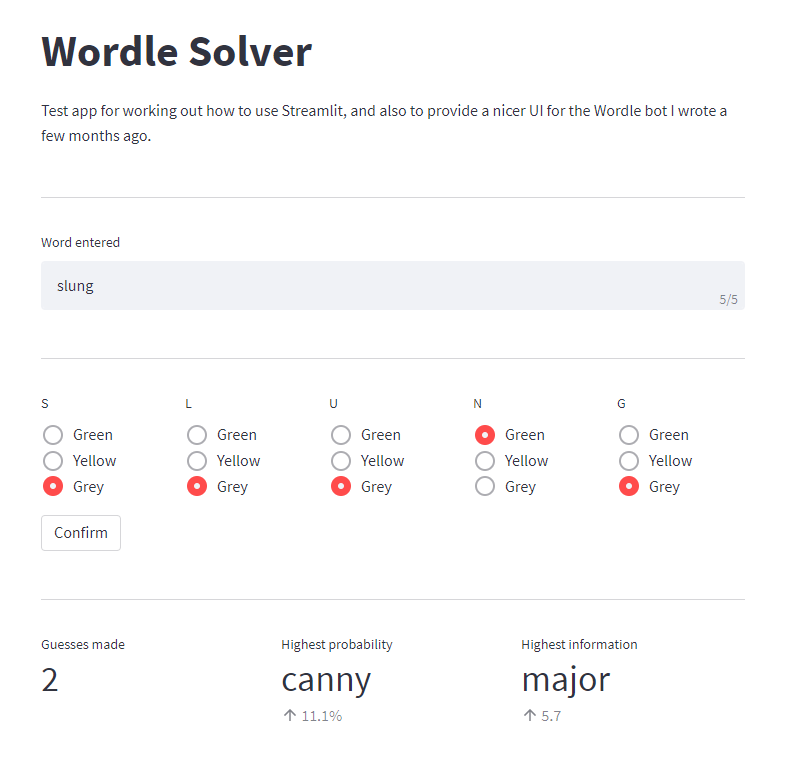

# Wordle Solver

## About

This is a small program for solving the [Wordle](https://www.nytimes.com/games/wordle/index.html) daily word game that I wrote when it was first doing the rounds.
It's far from optimal, but usually still gets the word, and I wrote it in a few hours with some friends watching on Discord, so decided to leave it like that before I sunk too much time into it.

A few months later I wanted to learn how to use [Streamlit](https://streamlit.io/), so came back to it to write a simple UI.
The app can now be run using the old (and slightly janky) CLI, or with the GUI.

## Usage

On each go, the bot will spit out two words.

-   **Highest probability**: the word it thinks is most likely to be the correct word, along with the estimated probability.
    Guess this word when the probability starts getting above roughly 0.2, or when it increases significantly over a few goes without the word changing.
    (A rough heuristic I was using is that when the probability increases 20-fold with the same word, it's probably right.)

-   **Highest information**: the word it thinks will give it the most information, along with the proportion of the current entropy (of the letter/word distribution) that it expects to remain after the guess.
    Typically this is the word that should be guessed for at least the first few rounds.

It then needs to be told which word was guessed, along with the feedback given by Wordle.

>   Note: when making guesses, the feedback is interpreted slightly incorrectly.
    This bot assumes that if a letter appears twice in the word, it will be marked as yellow both times (or green, if one is in the right place).
    For example, guessing `"banal"` where the correct answer is `"clasp"` is expected to return `grey yellow grey yellow yellow`.
    Fortunately it is easy to correct for this manually (I haven't implemented the fix programmatically yet): if your guess contains repeated letters and any of them are yellow or green, change any of the remaining grey ones to yellow.

### Data

Word lists will need to be put in text files in the `data/` folder.
The words should be whitespace-separated, and can be either lower or upper case.
Write a loader for the words in `solver/vocabulary.py`; see either `basic` or `comprehensive` for examples.

### CLI

Simply `pip install -r requirements.txt` and then `python play.py`.

Before making a guess, the bot will print out two `(str, float)` tuples corresponding to the highest probability and entropy guesses described above.
Guesses should be typed in, followed by a space, and then the colours that were returned from Wordle (0 is grey, 1 is yellow, and 2 is green).
For example:

```
> banal 21010
```

The CLI is highly *un*polished and not robust to errors, so putting in the wrong number of letters (or generally making any typos at all) will cause it to crash.
If it crashes after outputting a word with probability 1, that means it has found the right word.
If it crashes with a divide by zero error without outputting a guess, that means some combination of feedback has been put in that leaves no words in the vocabulary list.
Therefore either the answer is not in the vocabulary list the bot uses, or some feedback was entered incorrectly.

### GUI

Run `pip install -r requirements.txt` and then `streamlit run app.py`.

The resulting web page should look something like the following:



Pick a guess from the words described, type it in to the "word entered" box, and select the relevant feedback.
Then press "confirm" to update the probability distribution.
The GUI has slightly nicer error handling than the CLI but may still sometimes throw errors for edge cases.
